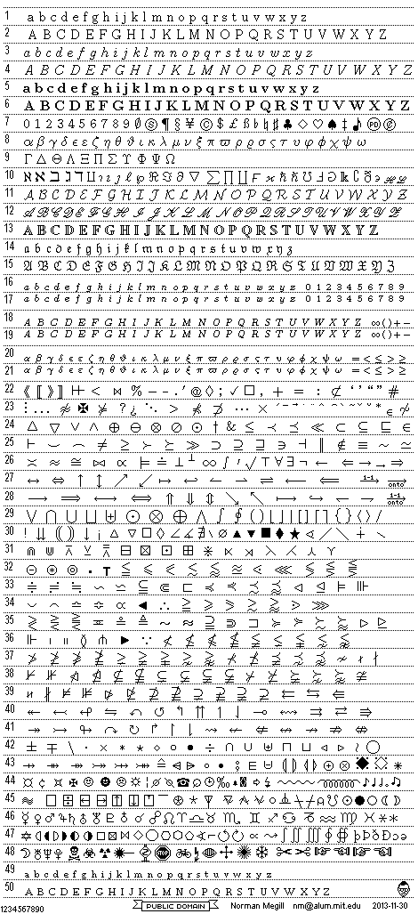

- **Title** : "GIF and PNG Images for Math Symbols"
- **Description**
  > "a collection of 1179 bit-mapped, 12-point, transparent images of mathematical letters and symbols, suitable for display on a web page."
- **License** : see [LICENSE](LICENSE)
  > This work was created by Norman Megill, who explicitly disclaims in perpetuity any copyright or other proprietary interest in this work, thereby granting it to the **public domain**.  
  > This means it may be used for any purpose whatsoever, with or without acknowledgement, commercial or non-commercial, including use in a separate or derivative copyrighted work.  
  > No warranty of any kind is expressed or implied.  
  > Any trademarks mentioned in this work belong to their respective owners and must be treated accordingly in any derivative work.
- **Website** : [http://us.metamath.org/symbols/symbols.html](http://us.metamath.org/symbols/symbols.html)
- **Properties** : 
  - 1 190 files
  - 320 Ko
  - no changes since : 30-Nov-2013
- **Main files** : 
  - [symbols.html](symbols.html)
  - [searchindex.html](searchindex.html)
  - [LICENSE](LICENSE)
  - [symbols.gif](symbols.gif)
    - 
- **For** : MechatronicBeing
- **Modifications** :
  - [beginning] download [http://us.metamath.org/downloads/symbols.zip](http://us.metamath.org/downloads/symbols.zip)
  - [beginning] extract symbols.zip
  - [beginning] move to "symbols/"
  - [cleaning] remove files starting with '_', **except** "_example1.gif", "_example2.gif" and "_nmemail.gif"
    * 938 files / 84,0 Ko removed
  - [cleaning] remove files with extension ".gif", **except** "mm.gif" and "symbols.gif"
    * 1 187 files / 32,0 Ko removed
  - [cleaning] edit "searchindex.html" : remove all lines with ".gif" references (line #2275, and lines #19 to #1147)
    * file size reduce from 140 Ko to 72,0 Ko
  - [debugging] edit "searchindex.html" : replace all references "kruez" to "kreuz" (line #1016)
    * [working] edit "symbols.html" : replace the ".gif" to ".png", **except** when "_example1.gif", "_example2.gif", "_nmemail.gif", "mm.gif" and "symbols.gif" is written
  - [TODO] sort all files, according to name or category, in corresponding folder.
    * reason : too many images to load on the browser (freezing a lot). AND, easier to find/look/work.
  - [TODO] edit "symbols.html" and "searchindex.html" to reflect changes.
  - [checking] inspect "symbols.html" with a web browser 
    * **result expected** : no exceptions displayed, all images are loaded
  - [checking] inspect "searchindex.html" with a web browser 
    * **result expected** : no exceptions displayed, all images are loaded
  - [ending] create "MechatronicBeing.md" file
  - [ending] edit "MechatronicBeing.md" : add some informations
  